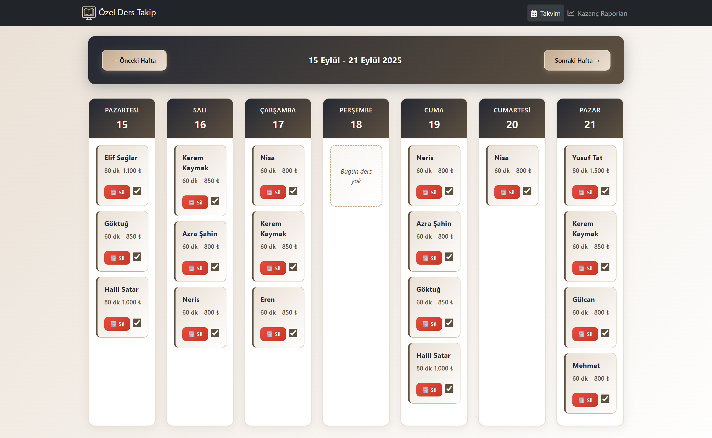
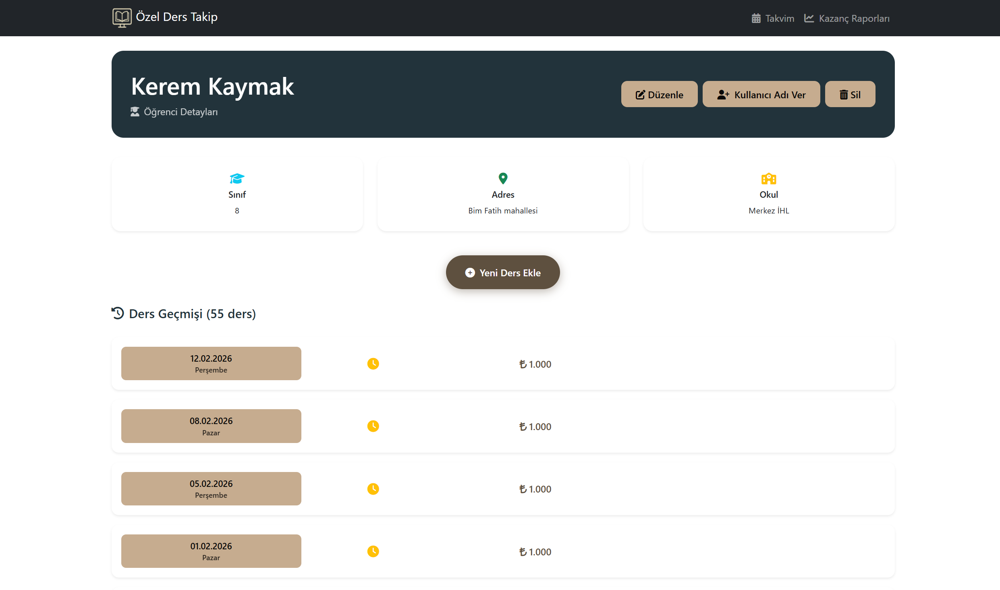
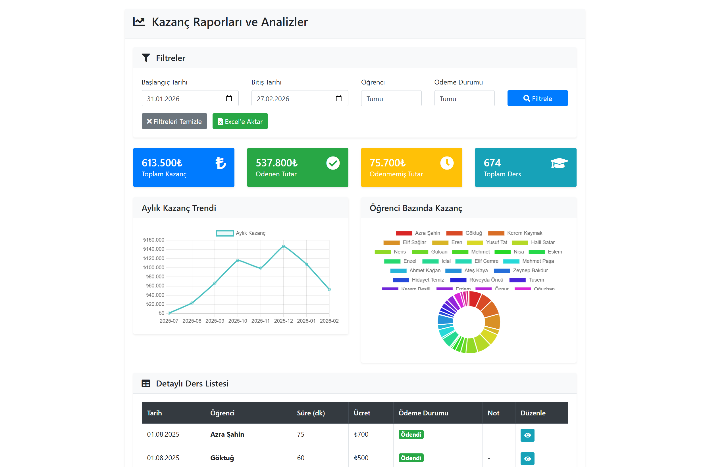
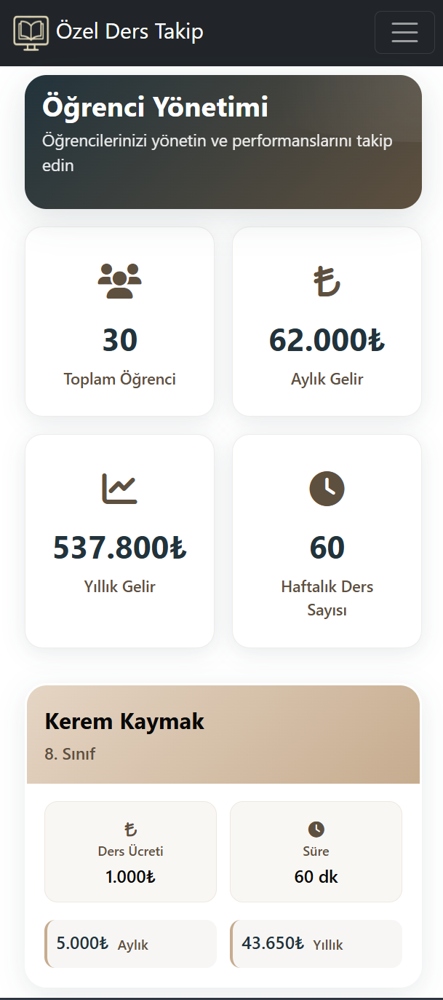
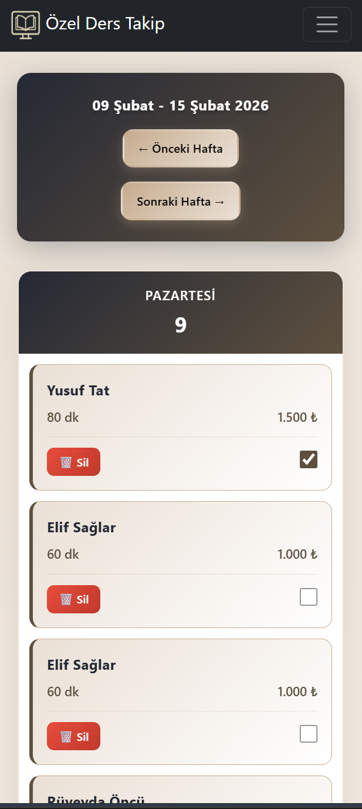
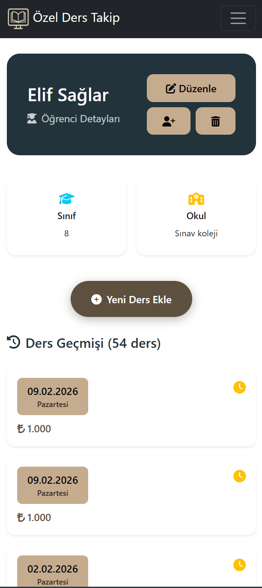
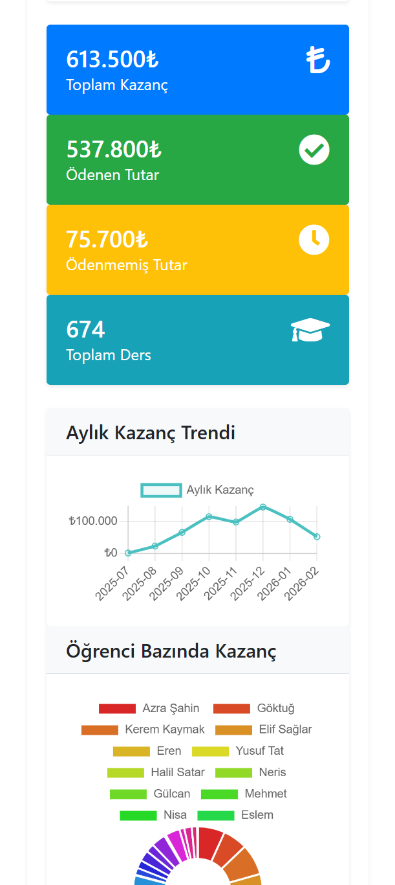
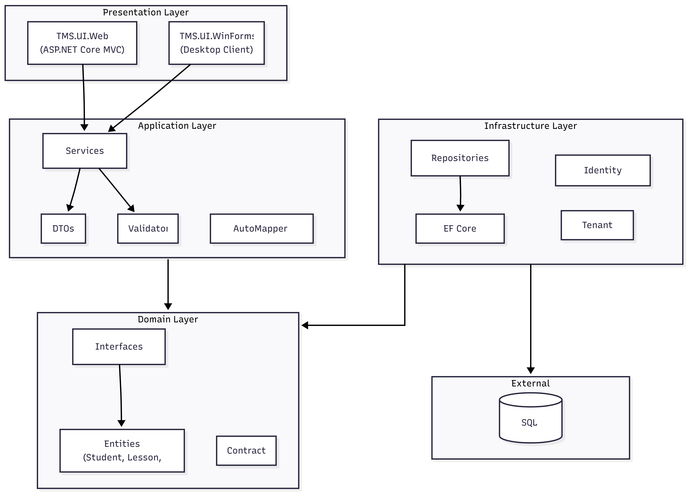
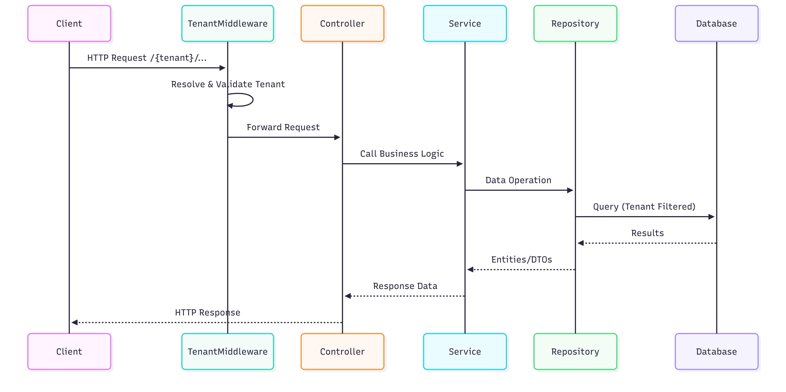

# Tutoring Management System

<p align="center">
  <strong>A comprehensive multi-tenant SaaS platform for private tutors to manage students, lessons, payments, and schedules.</strong>
</p>

<p align="center">
  
  
  
  
</p>

---

## Overview

**Tutoring Management System** is a modern web application designed for private tutors and educational institutions to efficiently manage their tutoring business. The platform provides a user-friendly interface for tracking students, scheduling lessons, monitoring payments, and analyzing earnings.

Built with Clean Architecture principles and multi-tenant support, Cadap allows multiple tutors to use the same platform with complete data isolation.

Actively using by 5 teachers and 50+ students

https://www.ozelderstakipsistemi.com

---

## ScreenShots
### Desktop
 
 

### Mobile
   
---

## Features

### Core Features
- **Student Management** - Create and manage student profiles with detailed information including contact details, grade level, and school information
- **Lesson Scheduling** - Schedule, track, and manage individual tutoring sessions with date, duration, and pricing
- **Payment Tracking** - Monitor paid and unpaid lessons, track earnings over time
- **Earnings Dashboard** - Visualize income with detailed reports and analytics
- **Calendar View** - Interactive calendar to view past and upcoming lessons

### Platform Features
- **Multi-Tenancy** - Each tutor gets their own isolated workspace with custom URL slug
- **Authentication & Authorization** - Secure login with ASP.NET Core Identity
- **Responsive Design** - Works seamlessly on desktop and mobile devices
- **Excel Export** - Export data to Excel using EPPlus
- **Comprehensive Logging** - Structured logging with Serilog
- **RESTful API** - Swagger/OpenAPI documentation for API endpoints

I used Multi-Tenancy to enable the project to scale for institutional use.

---

## Architecture

TMS follows **Clean Architecture** principles with clear separation of concerns:





### Request Flow



---

## Tech Stack

| Category | Technology |
|----------|------------|
| **Framework** | .NET 8.0, ASP.NET Core MVC |
| **Database** | SQL Server with Entity Framework Core 8.x |
| **Authentication** | ASP.NET Core Identity |
| **Object Mapping** | AutoMapper |
| **Logging** | Serilog (Console, File sinks) |
| **API Documentation** | Swashbuckle/Swagger |
| **Excel Export** | EPPlus |
| **Containerization** | Docker |
| **Frontend** | Razor Views, HTML5, CSS3, JavaScript |

---

## 📁 Project Structure

```
TMS/
├── TMS.sln                    # Solution file
├── Dockerfile                   # Docker build configuration
├── README.md                    # This file
│
├── TMS.Domain/                # Domain Layer
│   ├── Models/                  # Entity models (Student, Lesson, Tenant, etc.)
│   ├── Interfaces/              # Repository interfaces
│   ├── Contracts/               # Domain contracts (IMustHaveTenant, etc.)
│   └── Common/                  # Base entities and common types
│
├── TMS.Application/           # Application Layer
│   ├── Services/                # Business logic services
│   ├── DTO/                     # Data Transfer Objects
│   ├── Interfaces/              # Service interfaces
│   ├── Profiles/                # AutoMapper profiles
│   ├── Validators/              # Input validation
│   └── DependencyContainer.cs   # DI registration
│
├── TMS.Infrastructure/        # Infrastructure Layer
│   ├── Contexts/                # EF Core DbContext
│   ├── Repositories/            # Repository implementations
│   ├── Migrations/              # Database migrations
│   ├── CustomIdentity/          # Custom Identity managers
│   ├── Configurations/          # Entity configurations
│   ├── Settings/                # App settings models
│   ├── Store/                   # Tenant store
│   └── Routing/                 # Custom route constraints
│
├── TMS.UI.Web/                # Web Presentation Layer
│   ├── Controllers/             # MVC Controllers
│   ├── Views/                   # Razor Views
│   ├── Models/                  # View Models
│   ├── Middleware/              # Custom middleware (Tenant, etc.)
│   ├── StartupExtensions/       # Service registration extensions
│   ├── wwwroot/                 # Static files (CSS, JS, images)
│   └── Program.cs               # Application entry point
│
├── TMS.UI.WinForms/           # Windows Forms client (optional)
│
└── TMS.Shared/                # Shared utilities and caching
    └── Cache/                   # Caching utilities
```

---

## Multi-Tenancy

TMS supports multi-tenancy with URL-based tenant identification:

```
https://ozelderstakipsistemi.com/{tenant-slug}/Home
https://ozelderstakipsistemi.com/{tenant-slug}/Students
https://ozelderstakipsistemi.com/{tenant-slug}/Lessons 
etc.
```

Each tenant has:
- **Isolated data** - Complete data separation
- **Custom slug** - Unique URL identifier
- **Independent settings** - Per-tenant configuration

---

## 📬 Contact

The project is a close-source but I can give you the source code if you ask me!

[](https://www.linkedin.com/in/cihangir-yaman/) 

---

<p align="center">
  <em>Built with ❤️ for educators and tutors worldwide</em>
</p>
